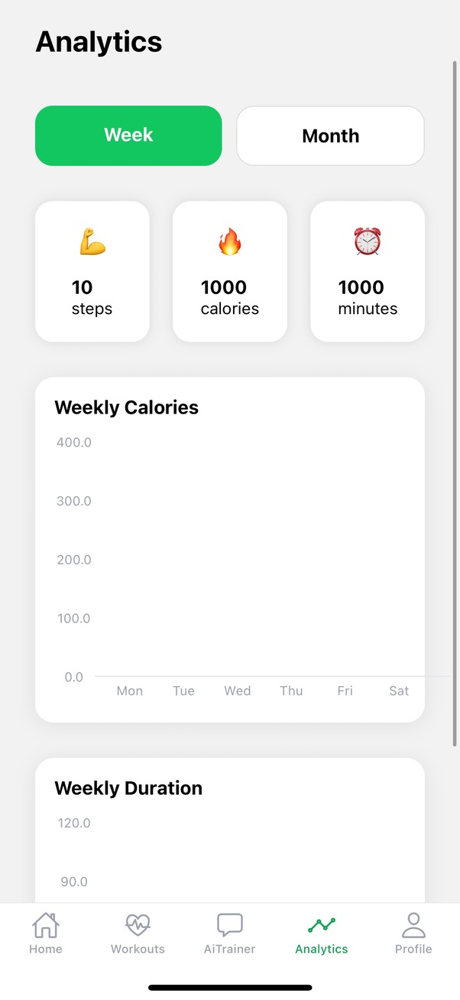
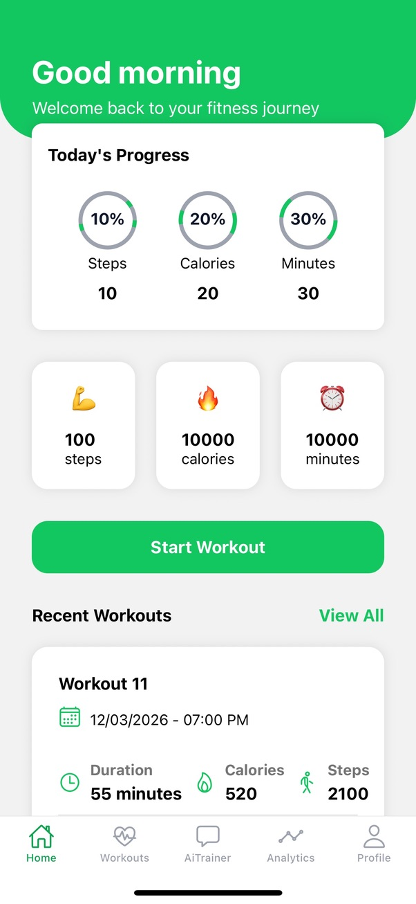
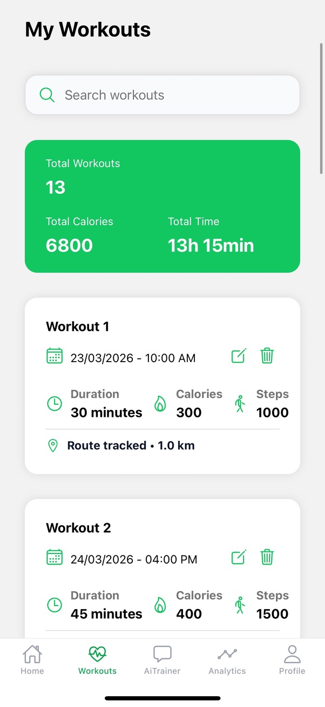
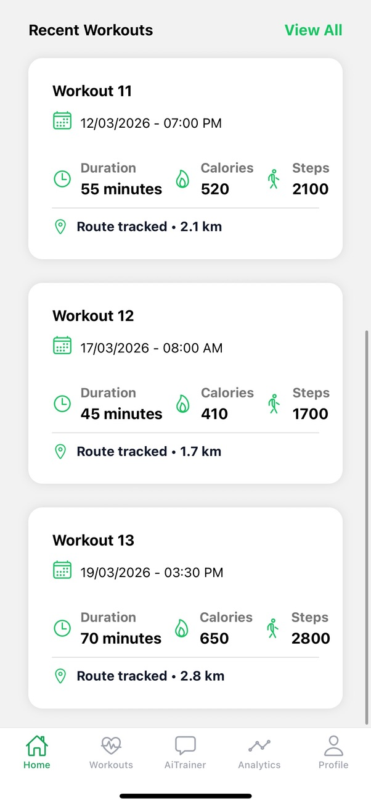
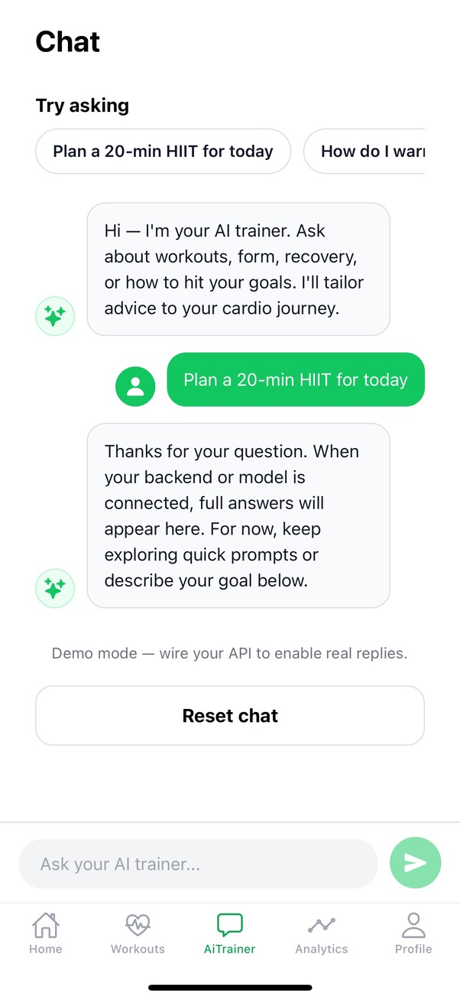
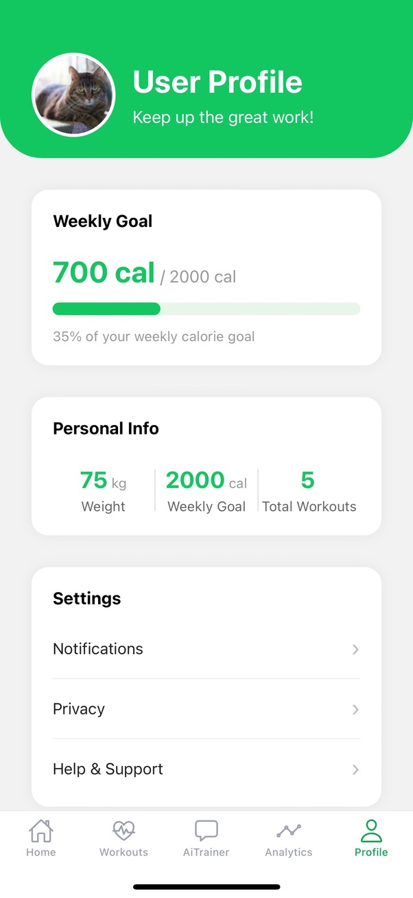

# 🏃 Fit Native Cardio

A modern **React Native** fitness tracking app built with **Expo**, featuring an AI trainer chat, workout analytics, and a clean green-accented UI — all in one shell ready for production wiring.

---

<!-- ## 📱 Screenshots

<p align="center">
  
  
  
  
  
  
</p> -->

---

## ✨ Features

| Screen | What it does |
|--------|-------------|
| **Home** | Time-based greeting, today's progress ring, key stats, and recent workouts at a glance |
| **Workouts** | Searchable list of all workouts with edit / delete actions |
| **AI Trainer** | Chat interface with quick-prompt shortcuts — ready to be wired to any LLM API |
| **Analytics** | Weekly / monthly bar charts for calories burned and workout duration (`react-native-gifted-charts`) |
| **Profile** | Personal info, weekly goal tracker, and app settings |

---

## 🛠 Tech Stack

| Layer | Library / Tool |
|-------|---------------|
| Framework | [Expo](https://expo.dev) ~54 |
| UI | React Native 0.81.5 + React 19 |
| Navigation | [React Navigation](https://reactnavigation.org) — bottom tabs + native stack |
| Charts | [react-native-gifted-charts](https://github.com/Abhinandan-Kushwaha/react-native-gifted-charts) |
| Gradients | expo-linear-gradient |
| Dates | [dayjs](https://day.js.org) |
| Icons | [@expo/vector-icons](https://icons.expo.fyi) (Ionicons) |
| Language | JavaScript (JSX) |

---

## 🚀 Getting Started

### Prerequisites

- [Node.js](https://nodejs.org) ≥ 18
- [Expo CLI](https://docs.expo.dev/get-started/installation/) — `npm install -g expo-cli`
- iOS Simulator / Android Emulator **or** the [Expo Go](https://expo.dev/go) app on your device

### Install

```bash
git clone https://github.com/YOUR_USERNAME/fit-native-cardio.git
cd fit-native-cardio
npm install
```

### Run

```bash
# Start Expo dev server (scan QR with Expo Go)
npm start

# Open on a connected iOS simulator
npm run ios

# Open on a connected Android emulator / device
npm run android

# Open in the browser
npm run web
```

---

## 📁 Project Structure

```
fit-native-cardio/
├── App.js                      # Root component, global styles
├── index.js                    # Expo entry point
├── app.json                    # Expo configuration
└── src/
    ├── navigation/
    │   ├── RootNavigator.jsx   # Auth guard → MainTabs or AuthNavigator
    │   ├── MainTabs.jsx        # Bottom tab bar (5 tabs)
    │   └── AuthNavigator.jsx   # Login / Register stack
    ├── screens/                # Thin screen wrappers
    ├── components/
    │   ├── Home/
    │   ├── Workouts/
    │   ├── AiTrainer/          # Chat UI components
    │   ├── Analytics/          # Chart components
    │   ├── Profile/
    │   └── Common/             # Shared UI primitives
    ├── services/
    │   └── workouts.js         # Mock workout data
    └── styles/
        └── Common.jsx          # Global shared styles
```

---

## 🤖 AI Trainer

The **AI Trainer** screen is a fully-built chat UI complete with quick-prompt shortcuts and message bubbles. It is currently in **demo mode** — the assistant replies are placeholder responses. To activate it, wire `src/components/AiTrainer/Index.jsx` to any LLM API (OpenAI, Gemini, etc.) inside the `handleSend` handler.

---

## 🎨 Design Tokens

| Token | Value |
|-------|-------|
| Brand green | `#12C660` |
| Active tint | `#0ea653` |
| App background | `#c3c4c7` |
| Status bar | Hidden |
| Orientation | Portrait |

---

## 🔮 Roadmap

- [ ] Connect real workout data source / REST API
- [ ] Implement authentication (Login / Register screens are scaffolded)
- [ ] Wire AI Trainer to an LLM API
- [ ] Add workout creation flow
- [ ] Persist data with AsyncStorage or a backend

---

## 📄 License

This project is open source. Feel free to fork, extend, and build on top of it.
